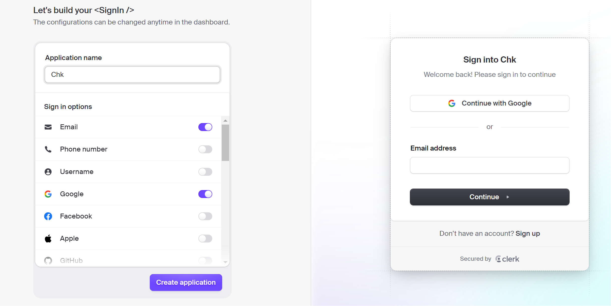

# Blood-Donation-Project

## Introduction

The Blood Donation Project is an initiative aimed at connecting individuals in need of blood with willing blood donors. The project utilizes npm (Node Package Manager) and version control using Git to manage the codebase and facilitate collaboration.

## Getting Started

To contribute to the project, follow the steps below:

**Please give it a star to support this open source project.**


1. **Fork the Repository**

   - Go to the GitHub repository at [https://github.com/Saurav-Pant/Blood-Donation-Project](https://github.com/Saurav-Pant/Blood-Donation-Project).
   - Click on the "Fork" button in the top-right corner of the page.
   - This will create a copy of the repository in your GitHub account.

2. **Clone the Repository**

   - On your local machine, open a terminal or command prompt.
   - Use the following command to clone the repository:
     ```bash
     git clone https://github.com/your-username/Blood-Donation-Project.git
     ```
   - This will create a local copy of the repository on your machine.

3. **Install Dependencies**

   - Run the following command to install the project dependencies using npm:
     ```bash
     npm install
     ```

4. **Configure Clerk**

   - Go to [Clerk](https://clerk.com/) and log in to your account and create an application.
   - Rename the `.env.example` file to `.env`:
     ```bash
     mv .env.example .env
     ```
   - Open the `.env` file and replace the placeholders with your actual Clerk keys:
     ```
     NEXT_PUBLIC_CLERK_PUBLISHABLE_KEY=your-clerk-publishable-key
     CLERK_SECRET_KEY=your-clerk-secret-key
     ```
   - Clerk Application configuration:
     

5. **Maintaining Synchronization**

   - Always take a pull from the repository to your master branch to keep it updated with the updated repository:
     ```bash
     git pull
     ```

6. **Start the Application**

   - Run the following command to start the website locally:
     ```bash
     npm run dev
     ```

7. **Creating a New Branch**

   - Before starting work on a new feature or bug fix, create a new branch with your GitHub profile name:

     ```bash
      git checkout -b your-github-profile-name
     ```

8. **Start Contributing**

   - Now that you have set up the project on your local machine, you can start contributing to the project by adding the necessary functionality to connect blood donors with individuals in need.

9. **Committing Changes**

   - After making changes to the code, use the following command to stage the changes:

     ```bash
     git add .
     ```

   - Commit the changes with a descriptive message:

     ```bash
      git commit -m "Add feature XYZ"
     ```

10. **Pushing Changes**

   - Push your changes to your forked repository:
     ```bash
      git push -u origin your-github-profile-name
     ```

11. To create a pull request, go to your fork of this repository,, you will see **`compare and pull requests`**. Click on that big green button

12. Add an appropriate title and description to your pull request explaining your changes and efforts done.

13. Click on **`Create Pull Request`**.

14. Voila! You have made a PR to the **Blood-Donation-Project** 💥 Wait for your submission to be accepted and your PR to be merged 🎉
    
## Quick Docker Setup
### Requirement:

* Docker Desktop
  
### Let's Begin:
1. Make sure you have followed **step-4 (Configure Clerk)** from the above procedure.
2. #### Verify Docker Status:
To ensure a seamless Docker experience, it's essential to check the status of the Docker service on your system.To verify whether the Docker service is currently active or inactive, you can use the following steps:
* Check Docker Service Status:
```bash
systemctl status docker
```
if it's inactive, you'll need to take corrective action.

* To activate the Docker service, use the following command:
```bash
systemctl start docker
```
3. #### Build:
Now, let's build the Docker image named 'blood-donation' using the docker build command:
```bash
docker build -t blood-donation .
```
4. #### Run:
Write the following command to run a Docker container named 'blood_donation '
```bash
docker run -p 8080:3000 --name blood_donation blood-donation
```
5. Wait until the ***Ready*** message to appear.
6. Search the following syntax in your web browser to view the website.
```bash
localhost:8080
```

## Contributing Guidelines

When contributing to the Blood Donation Project, please ensure that you follow these guidelines:

- Before starting work on a new feature or bug fix, create a new branch for your changes.
- Make your changes and test them thoroughly.
- Ensure that your code follows the project's coding style and conventions.
- Write clear commit messages that explain the purpose and details of your changes.
- Push your changes to your forked repository.
- Submit a pull request to the original repository, clearly describing the changes you have made.

## Conclusion

The Blood Donation Project aims to make a positive impact by connecting blood donors with individuals in need of blood. By following the steps mentioned above, you can contribute to this project and help save lives. Thank you for your support!
